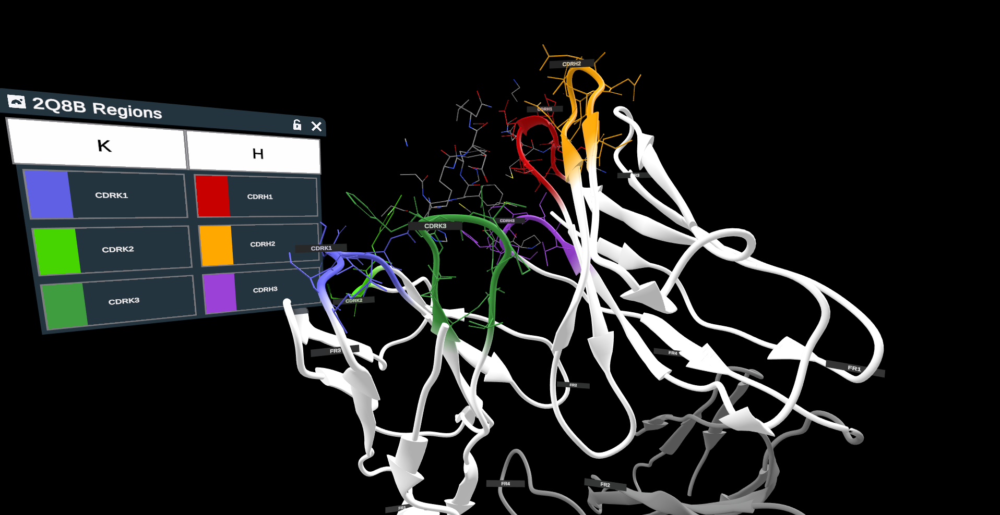

# Nanome - Antibodies

Visualize and build antibody proteins with Nanome.




When run, any selected antibody in the workspace will be colored according to the IMGT CDR Color Menu
https://www.imgt.org/IMGTScientificChart/RepresentationRules/colormenu.php#h1_26

The plugin also opens a menu which provides easy selection of cdr loops and chains.

## Usage

To run Antibodies in a Docker container:

```sh
$ cd docker
$ ./build.sh
$ ./deploy.sh [run_args]
```

### Run args

These args are passed to deploy.sh, and then forwarded to the Plugin's run.py command

```sh
usage: run.py [-h] [-a HOST] [-p PORT] [-r] [-v] [-n NAME] [-k KEYFILE]
              [-i IGNORE] [--write-log-file WRITE_LOG_FILE]

Starts a Nanome Plugin.

optional arguments:
  -h, --help            show this help message and exit
  -a HOST, --host HOST  connects to NTS at the specified IP address
  -p PORT, --port PORT  connects to NTS at the specified port
  -r, --auto-reload     Restart plugin automatically if a .py or .json file in
                        current directory changes
  -v, --verbose         enable verbose mode, to display Logs.debug
  -n NAME, --name NAME  Name to display for this plugin in Nanome
  -k KEYFILE, --keyfile KEYFILE
                        Specifies a key file or key string to use to connect
                        to NTS
  -i IGNORE, --ignore IGNORE
                        To use with auto-reload. All paths matching this
                        pattern will be ignored, use commas to specify
                        several. Supports */?/[seq]/[!seq]
  --write-log-file WRITE_LOG_FILE
                        Enable or disable writing logs to .log file

```

## Development
To run Antibodies with autoreload:

```sh
$ python3 -m pip install -r requirements.txt
$ python3 run.py -r [run_args]
```

## License

MIT
